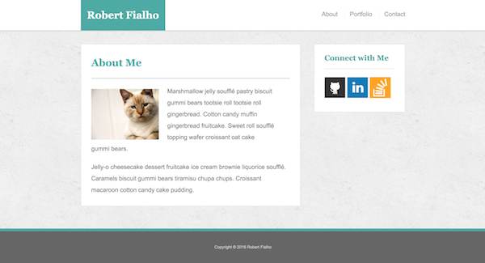
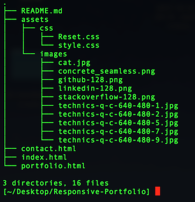

## Try my Responsive Portfolio.

https://robydoidao2006.github.io/Responsive-Portfolio/

## What the Responsive Portfolio looks like

## Adicional Information
- This was my first html/css mutiple pages.
- Very simple but efficient 
- 3 pages all linked to one another 
- Also 3 external links to linkedIn, Github and Stackoverflow.

## This app was build using html and css for the static.

## How to Run the Game Localy
- Clone / Download the repository.
- Unzip the file.
- Drag and drop the unzip folder on a text editor of your choice.
- Look for the index.html and get it to display on the text editor, right click and open on browser(or command b)
- Your default browser should open and load the page automatically.

## folder Structure

## Future Improvements
- Personalize the Web page
- Fix the mail system 

